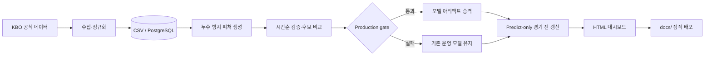

# KBO Prediction Lab

KBO 공식 데이터를 수집하고, 경기 전 정보를 반영해 승패 확률과 예상 득점을 생성하는 스포츠 분석 프로젝트입니다. 데이터 수집부터 피처 엔지니어링, 시간순 검증, 모델 아티팩트 운영, 정적 대시보드 배포까지 하나의 파이프라인으로 구성했습니다.

[대시보드 보기](https://raw.githack.com/SaRangWOO/sports_analytics/main/docs/latest.html) · [KBO 분석 문서](kbo_analytics/README.md) · [시스템 아키텍처](docs/ARCHITECTURE.md) · [모델 검증 원칙](docs/MODEL_GOVERNANCE.md)

> 예측 결과는 모델링 포트폴리오와 분석 참고용입니다. 베팅 수익을 보장하지 않으며, 시장 배당이나 임의의 핸디캡 라인을 생성하지 않습니다.

## 프로젝트 핵심

이 프로젝트는 단순히 순위와 상대전적을 나열하지 않습니다.

- KBO 공식 일정·결과·팀·선수·선발·라인업 데이터를 자동 수집합니다.
- 모든 rolling 피처는 현재 경기 결과를 제외한 `shift(1)` 기준으로 계산합니다.
- 승패 분류 모델과 독립 득점 모델을 분리해 비교합니다.
- Accuracy뿐 아니라 Brier Score, Log Loss, calibration, 확신 구간 성능을 함께 평가합니다.
- 후보 모델은 bootstrap 신뢰구간과 production gate를 통과한 경우에만 승격합니다.
- 경기 전 재실행은 승인된 모델 아티팩트를 사용하는 predict-only 경로로 처리합니다.
- 공식 경기 시작 이후에 수집된 투수 스냅샷은 예측용 데이터에서 제외합니다.

## 현재 결과

| 구분 | 현재 상태 |
| --- | --- |
| 운영 승패 모델 | RandomForest 보수 시간가중 모델 |
| 검증 정확도 | 0.542 |
| 독립 득점 모델 | Tweedie |
| 득점 MAE / RMSE | 2.7396 / 3.4673 |
| 득점 기반 승패 변환 정확도 | 0.5247 |
| 투수 스냅샷 | 56일, 552행, 품질 검사 통과 |
| 투수 challenger 승격 | 보류 (`safe_to_replace_model=false`) |
| 경기 전 갱신 | production artifact 기반 predict-only |

수치는 저장소의 2026-08-25 추적 결과 기준입니다. 최신 결과는 [`win_predictor_model.json`](kbo_analytics/modeling/results/win_predictor_model.json), [`expected_runs_model.json`](kbo_analytics/run_model/results/expected_runs_model.json), [`production_model_gate_audit.json`](kbo_analytics/modeling/results/production_model_gate_audit.json)에서 확인할 수 있습니다.

정확도 54% 수준을 과장하지 않는 것이 이 프로젝트의 중요한 원칙입니다. 작은 성능 상승이 관찰되더라도 bootstrap 신뢰구간이 0을 포함하거나 calibration이 악화되면 운영 모델을 교체하지 않습니다.

## 대시보드

통합 대시보드는 하나의 화면에서 세 가지 관점을 제공합니다.

1. **경기 예측**: 운영 승패 모델의 예측팀, 승률, 정보 품질, 선발·라인업 상태
2. **득점 기반 승부 예측**: 독립 모델의 홈·원정 예상 득점과 예상 득실차
3. **KT Wiz 승리 예측**: KT 경기만 모아 보는 팀 특화 분석

정적 포트폴리오 링크:

- [통합 KBO 대시보드](https://raw.githack.com/SaRangWOO/sports_analytics/main/docs/latest.html)
- [저장소 내 HTML](docs/latest.html)

## 시스템 흐름



자세한 컴포넌트와 데이터 계약은 [아키텍처 문서](docs/ARCHITECTURE.md)에 정리했습니다.

## 저장소 구조

```text
sports_analytics/
├── README.md                         # 포트폴리오 소개
├── docs/                             # 외부 공개용 정적 대시보드와 기술 문서
│   ├── latest.html
│   ├── ARCHITECTURE.md
│   └── MODEL_GOVERNANCE.md
├── kbo_analytics/                    # 운영 KBO 분석 파이프라인
│   ├── official_kbo_dashboard.py     # 공식 데이터 수집·통합 오케스트레이션
│   ├── config/                       # 운영 확률 정책
│   ├── data/official/                # 공식 원천·스냅샷 CSV
│   ├── modeling/                     # 피처, 학습, 검증, artifact, predict-only
│   ├── run_model/                    # 독립 득점 예측 모델
│   ├── scripts/                      # 일일·경기 전 자동화와 관리 CLI
│   ├── dashboard/                    # 서버 제공 HTML
│   └── reports/                      # 패리티·감사 리포트
└── kbo_run_model/                    # 득점 모델 초기 연구 프로토타입
```

`kbo_analytics/run_model`은 현재 통합 대시보드에서 사용하는 독립 득점 모델입니다. 루트의 `kbo_run_model`은 모델 구조와 데이터 소스를 탐색한 초기 연구 패키지로 보존합니다.

## 주요 기술

- **Language**: Python 3.10+
- **Data**: pandas, NumPy, CSV, PostgreSQL
- **Modeling**: scikit-learn, RandomForest, HistGradientBoosting, Tweedie/Poisson/Ridge
- **Validation**: chronological split, rolling backtest, bootstrap CI, calibration audit
- **Serving**: 정적 HTML, Python HTTP server, Docker Compose
- **Operations**: cron, shell automation, Git-based output publishing, atomic file replacement

## 빠른 실행

```bash
git clone https://github.com/SaRangWOO/sports_analytics.git
cd sports_analytics/kbo_analytics

python3 -m venv .venv
.venv/bin/pip install -r requirements.txt
cp .env.example .env

docker compose up -d
.venv/bin/python official_kbo_dashboard.py \
  --reference-date 2026-08-25 \
  --training-start-year 2016
```

생성된 대시보드 확인:

```bash
python3 -m http.server 8501 -d dashboard
```

브라우저에서 `http://127.0.0.1:8501/latest.html`을 엽니다.

저비용 검증:

```bash
.venv/bin/python scripts/kbo_tasks.py smoke
.venv/bin/python -m unittest \
  modeling.test_model_artifacts \
  modeling.test_predict_only \
  modeling.test_pitching_snapshot_storage
```

## 설계에서 중요하게 본 점

### 1. 예측 시점 정합성

완료 경기만 학습에 사용하고, 모든 누적·최근 흐름 피처는 현재 경기 이전 데이터로 계산합니다. 최신 선수 기록을 과거 경기에 일괄 결합하지 않습니다.

### 2. 모델과 표시 정책 분리

승률 자체와 대시보드 추천 등급을 분리합니다. 추천 문구를 바꿔 확률이 좋아진 것처럼 표현하지 않습니다.

### 3. 후보 모델의 fail-closed 승격

후보가 기준 모델보다 일부 지표에서 좋아도 전체 gate를 통과하지 못하면 운영 모델은 유지됩니다. 현재 투수 스냅샷 challenger도 이 원칙에 따라 승격하지 않았습니다.

### 4. 재학습과 예측 실행 분리

전체 모델 평가는 명시적인 개발 작업으로 두고, 빈번한 경기 전 갱신은 승인된 artifact를 불러오는 predict-only 경로를 사용합니다. 동일 입력에 대한 full/predict-only 확률 패리티도 검사합니다.

## 한계와 다음 단계

- 확정 라인업의 과거 시점별 데이터가 아직 충분하지 않습니다.
- 실제 불펜 투구 수와 핵심 불펜 연투 여부를 장기간 축적해야 합니다.
- 투수 스냅샷 challenger는 최소 경기 수와 bootstrap 안정성 gate를 통과하지 못했습니다.
- 모델 정확도보다 확률 calibration과 경기 유형별 안정성 개선이 우선입니다.
- 다음 실험은 선발 최근 3경기, 휴식일, 실제 불펜 투구 수를 as-of 기준으로 결합한 walk-forward 검증입니다.

## 문서

- [KBO 분석 실행·데이터 계약](kbo_analytics/README.md)
- [시스템 아키텍처](docs/ARCHITECTURE.md)
- [모델 검증과 승격 정책](docs/MODEL_GOVERNANCE.md)
- [독립 득점 모델 프로토타입](kbo_run_model/README.md)
