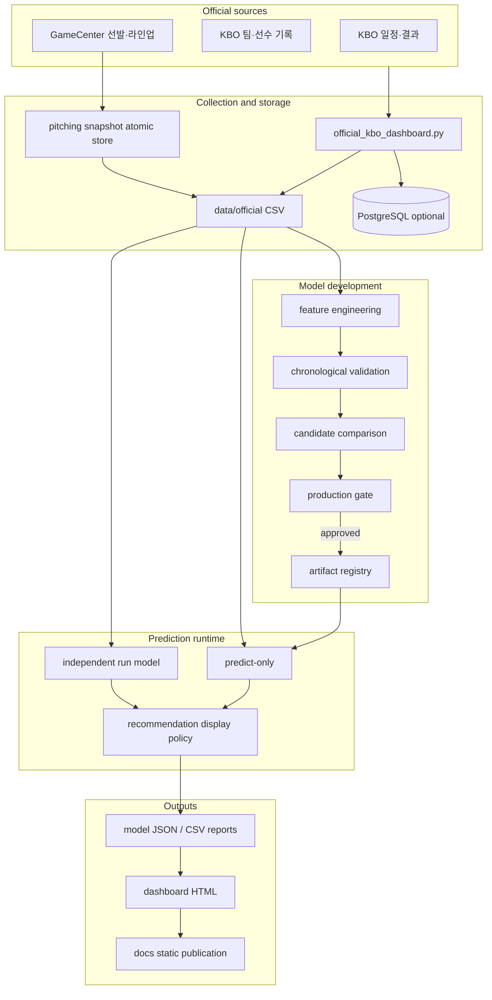

# System Architecture

## 1. 목적

KBO Prediction Lab은 데이터 수집, 모델 개발, 운영 예측을 분리합니다. 매 경기 전 전체 모델을 다시 학습하는 구조를 피하고, 검증된 모델 아티팩트로 현재 경기 피처만 다시 계산합니다.

## 2. 컴포넌트



## 3. 데이터 계층

### 공식 데이터

`kbo_analytics/data/official/`은 KBO 원천을 정규화한 CSV 계층입니다.

| 데이터 | 역할 |
| --- | --- |
| `game_results.csv` | 일정, 완료 결과, 취소 상태 |
| `model_training_games.csv` | 완료 경기 학습 입력 |
| `prediction_games.csv` | 기준일 예정 경기 입력 |
| `pitching_context.csv` | 현재 기준 선발과 불펜 proxy |
| `lineup_context.csv` | 현재·최근 라인업과 WAR |
| `pitching_daily_snapshot.csv` | 예측 시점 기준 투수 정보 누적 |
| `pitching_snapshot_schedule.csv` | 공식 경기 ID와 시작 시각 |

CSV는 대시보드 생성의 필수 경로입니다. PostgreSQL 적재는 조회·확장용이며 연결 실패가 HTML/CSV/JSON 생성을 막지 않습니다.

### 검증 결과

`kbo_analytics/modeling/results/`에는 모델 성능과 운영 gate 결과가 저장됩니다.

- 후보 모델 비교와 시간순 검증
- calibration과 확률 분포
- bootstrap confidence interval
- 피처 누수 감사
- 경기 유형별 성능
- recommendation outcome audit
- pipeline health status

## 4. 모델 계층

### 운영 승패 모델

완료 경기를 팀 기준 또는 경기 기준 피처로 변환해 승패 확률을 예측합니다. 모델 후보는 동일한 시간순 검증 구간에서 Accuracy, Brier Score, Log Loss를 비교합니다.

### 독립 득점 모델

`kbo_analytics/run_model/`은 팀별 예상 득점을 먼저 추정합니다.

```text
홈 예상 득점 - 원정 예상 득점
→ expected_run_diff
→ home_win_probability
```

승패 모델 결과를 입력으로 사용하지 않기 때문에 두 모델의 방향 일치 여부를 독립적으로 확인할 수 있습니다.

### 투수 스냅샷 challenger

투수 스냅샷은 다음 조건으로 관리합니다.

```text
snapshot_time < scheduled_start_datetime
```

동일 경기·팀에 여러 수집본이 있으면 예측 실행 시각 이전의 최신 행을 선택합니다. 공식 경기 ID와 연결되지 않거나 경기 시작 이후 생성된 행은 canonical 예측 데이터에 저장하지 않습니다.

현재 challenger는 일부 확률 지표 개선 신호가 있지만 전체 정확도와 bootstrap 안정성 gate를 통과하지 못해 운영 모델에 반영하지 않습니다.

## 5. 모델 아티팩트

아티팩트는 다음 계약을 가집니다.

```text
manifest.json
metadata.json
feature_schema.json
metrics.json
model.joblib
```

검증 항목:

- 파일 체크섬
- artifact/schema 버전
- 승인 상태
- 피처 순서와 개수
- 필수·선택 피처 계약
- Python/scikit-learn 호환성
- smoke prediction

운영 artifact가 없으면 경기 전 스크립트는 기존 full 경로로 fallback합니다. artifact가 있으면 predict-only를 사용합니다.

## 6. 실행 경로

### Daily full update

```text
KBO 수집
→ 완료 경기 반영
→ 모델 평가
→ 예정 경기 예측
→ 득점 모델 실행
→ HTML 생성
→ 산출물 Git 동기화
```

### Pregame update

```text
선발·라인업 재수집
→ 현재 경기 피처 재생성
→ production artifact predict-only
→ 독립 득점 모델 갱신
→ HTML 재생성
```

`today_expected_runs_predictions.csv`는 기준일 예정 경기 전용이고, `expected_runs_predictions.csv`는 validation 결과 전용입니다.

## 7. 장애와 롤백

- CSV 저장은 임시 파일 작성 후 `os.replace`로 교체합니다.
- 기존 날짜·canonical key 유실과 행 수 급감을 차단합니다.
- 새 artifact 승격 전 현재 production artifact를 `previous`로 보존합니다.
- predict-only 실패 시 기존 대시보드와 full 경로를 사용할 수 있습니다.
- PostgreSQL 적재 실패는 pipeline health warning으로 기록하되 정적 산출물 생성은 계속합니다.

## 8. 경계

- UI는 모델 계산을 변경하지 않습니다.
- 추천 등급은 모델 확률과 별도 정책입니다.
- 최신 선수 스냅샷을 과거 경기 전체에 붙이지 않습니다.
- 검증 결과와 오늘 예측 결과를 같은 CSV로 사용하지 않습니다.
- 후보 모델은 명시적 승격 전 production으로 사용하지 않습니다.
