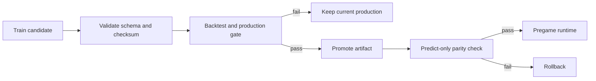

# Model Governance

## 목표

이 프로젝트의 모델 운영 목표는 가장 높은 단일 정확도를 찾는 것이 아니라, 미래 경기에서도 재현 가능한 개선만 production에 반영하는 것입니다.

## 시간적 검증

- 학습과 검증은 경기일 기준으로 분리합니다.
- rolling·expanding 피처는 현재 경기 이전 값만 사용합니다.
- 오늘 예측용 학습 cutoff는 예측일 전날입니다.
- validation cutoff와 오늘 예측용 cutoff를 별도로 기록합니다.
- 최신 선수·투수 누적 기록을 과거 경기 학습에 일괄 결합하지 않습니다.

## 평가 지표

| 지표 | 목적 |
| --- | --- |
| Accuracy | 승패 방향 적중률 |
| Brier Score | 확률 오차 |
| Log Loss | 잘못된 고확률 예측에 대한 페널티 |
| Calibration | 예측 확률과 실제 빈도의 일치 |
| Over-55 accuracy | 상대적으로 확신한 구간의 품질 |
| Recent-season accuracy | 최근 환경에서의 성능 유지 |
| Bootstrap CI | 관찰된 개선의 안정성 |

## Production gate

후보 모델은 다음 조건을 함께 검토합니다.

1. 기준 모델 대비 Accuracy가 의미 있게 개선될 것
2. Brier Score와 Log Loss가 악화되지 않을 것
3. bootstrap 신뢰구간이 개선 방향을 지지할 것
4. calibration bucket이 악화되지 않을 것
5. 최근 시즌과 주요 경기 segment가 무너지지 않을 것
6. 데이터 누수 감사에 실패 항목이 없을 것

일부 지표만 좋아진 후보는 challenger로 기록하고 production에는 반영하지 않습니다.

## 현재 투수 challenger 판정

투수 스냅샷 후보는 55일 이상 누적됐지만 다음 gate를 통과하지 못했습니다.

- `minimum_matched_games_300`
- `accuracy_delta_greater_than_0_005`
- `bootstrap_ci_stable`

따라서 현재 상태는 다음과 같습니다.

```text
safe_to_replace_model = false
safe_to_use_pitching_snapshot_as_features = false
```

이는 데이터가 쓸모없다는 뜻이 아니라, 운영 모델 교체를 정당화할 증거가 아직 부족하다는 뜻입니다.

## 모델과 추천 정책

대시보드의 `추천`, `약우세`, `관망`은 모델 확률을 설명하는 표시 정책입니다. 문구 변경은 모델 성능 개선으로 기록하지 않습니다.

- 승패 확률은 모델 산출값을 유지합니다.
- 추천 등급은 백테스트 구간과 정보 품질을 표시합니다.
- 핸디캡·오버/언더는 유효한 시장 라인이 없으면 `not_available`로 둡니다.
- 사후 결과 감사는 pregame 피처에 사용하지 않습니다.

## Artifact lifecycle



artifact에는 모델 파일뿐 아니라 피처 순서, class 순서, 학습 cutoff, 선택 지표와 승인 상태가 함께 저장됩니다.

## 재현 가능한 보고

주요 판단 근거는 코드가 아니라 결과 파일에도 남깁니다.

- `production_model_gate_audit.json`
- `model_bootstrap_confidence_report.csv`
- `model_calibration_diagnostics_report.csv`
- `non_pitching_feature_leakage_audit.csv`
- `pitching_snapshot_candidate_gate_audit.json`
- `daily_pipeline_health_status.json`

이 구조를 통해 모델을 교체하지 않은 결정도 재검토할 수 있습니다.
